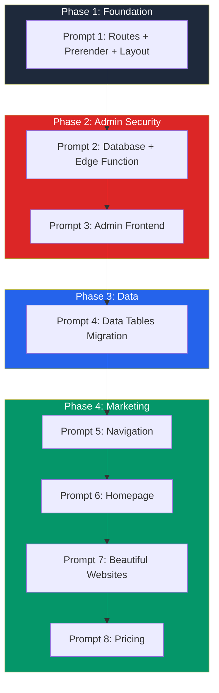

# Lovable Prompt Chain for EverIntent SmartSites (BRD v32.1)

Let me review the current BRD v32.1 and PRD prompt to build a proper, sequenced prompt chain for you.

Now let me see the rest of the PRD prompt to understand the full build order and requirements:

Now let me check the build order section from the BRD to ensure I have the correct sequencing:

Now I have the full picture. Let me also check the current vite.config.ts to see what we're working with:

Now I have the complete picture. Let me create the updated prompt chain aligned with **BRD v32.1**, with the correct build order.

---

## Updated Lovable Prompt Chain for EverIntent SmartSites (BRD v32.1)

You're connected to **GitHub**, **Supabase**, and **Vercel Pro**. Here's the sequenced prompt chain with proper dependency ordering:

---

### **PROMPT 1: Foundation + Routes + Pre-rendering**

> **Paste this prompt first:**

```markdown
Build the foundation for EverIntent SmartSites marketing site per BRD v32.1.

**Tech Stack:**
- Vite + React 18 + TypeScript (already set up)
- Tailwind CSS with shadcn/ui
- react-router-dom v6
- vite-plugin-prerender for SEO
- react-helmet-async for meta tags

**1. Install dependencies:**
- vite-plugin-prerender
- react-helmet-async

**2. Create `src/config/routes.ts`:**
Include ALL routes from BRD Section 15.1.1:
- Core pages (/, /pricing, /portfolio, /about, /contact, /book-call)
- Primary service: /beautiful-websites
- Services: /services, /get-found-online, /never-miss-a-lead, /book-more-jobs, /run-from-your-phone, /build-your-reputation, /let-ai-handle-it, /domains
- Features: /features/lead-capture, /features/ai-chat, /features/review-management, /features/mobile-app, /features/scheduling, /features/analytics
- Industry hubs: /industries/home-services, /industries/professional-services, /industries/health-wellness, /industries/automotive-services
- All 65+ industry verticals nested under hubs (e.g., /industries/home-services/hvac)
- Checkout: /checkout/smart-site, /checkout/smart-lead, /checkout/smart-business, /checkout/smart-growth, /checkout/success
- Legal: /legal/privacy, /legal/terms, /legal/data-request
- LocalPros: /localpros, /localpros/apply, /localpros/success-stories
- /upgrade
- Admin (NOT pre-rendered): /admin/login, /admin, /admin/submissions, /admin/portfolio, /admin/testimonials

Export `prerenderRoutes` array with ALL marketing routes (exclude /admin/*).

**3. Update `vite.config.ts`:**
Add vite-plugin-prerender, import prerenderRoutes from config, exclude /admin/* from prerendering.

**4. Create `src/components/SEO.tsx`:**
Reusable component using react-helmet-async for title, description, og tags, canonical URL.

**5. Create placeholder Layout components:**
- `src/components/layout/Layout.tsx` - wraps pages with Header + Footer
- `src/components/layout/Header.tsx` - placeholder with logo
- `src/components/layout/Footer.tsx` - placeholder

**6. Update `App.tsx`:**
- Wrap in HelmetProvider
- Keep only `/` route for now
- Add catch-all `*` route for NotFound
```

---

### **PROMPT 2: Admin Security (Database + Edge Function)**

> **CRITICAL: Run this before building any admin pages. This sets up the secure auth pattern.**

```markdown
Set up secure admin authentication per BRD v32.1 Section 15.2-15.4.

**1. Run this database migration in Supabase:**

```sql
-- Role enum
CREATE TYPE public.app_role AS ENUM ('admin', 'moderator', 'user');

-- User roles junction table
CREATE TABLE public.user_roles (
  id UUID PRIMARY KEY DEFAULT gen_random_uuid(),
  user_id UUID REFERENCES auth.users(id) ON DELETE CASCADE NOT NULL,
  role app_role NOT NULL,
  created_at TIMESTAMP DEFAULT NOW(),
  UNIQUE (user_id, role)
);

-- Allowed admin emails (OTP whitelist)
CREATE TABLE public.allowed_admin_emails (
  id UUID PRIMARY KEY DEFAULT gen_random_uuid(),
  email TEXT UNIQUE NOT NULL,
  created_at TIMESTAMP DEFAULT NOW(),
  created_by UUID REFERENCES auth.users(id)
);

-- Enable RLS
ALTER TABLE public.user_roles ENABLE ROW LEVEL SECURITY;
ALTER TABLE public.allowed_admin_emails ENABLE ROW LEVEL SECURITY;

-- Security definer function (bypasses RLS safely)
CREATE OR REPLACE FUNCTION public.has_role(_user_id UUID, _role app_role)
RETURNS BOOLEAN
LANGUAGE SQL
STABLE
SECURITY DEFINER
SET search_path = public
AS $$
  SELECT EXISTS (
    SELECT 1
    FROM public.user_roles
    WHERE user_id = _user_id
      AND role = _role
  )
$$;

-- RLS Policies
CREATE POLICY "Admins can manage roles" ON public.user_roles
  FOR ALL USING (public.has_role(auth.uid(), 'admin'));

CREATE POLICY "Admins can manage allowed emails" ON public.allowed_admin_emails
  FOR ALL USING (public.has_role(auth.uid(), 'admin'));
```

**2. Create Edge Function `supabase/functions/verify-admin-email/index.ts`:**

```typescript
import { serve } from "https://deno.land/std@0.168.0/http/server.ts";
import { createClient } from "https://esm.sh/@supabase/supabase-js@2";

const corsHeaders = {
  "Access-Control-Allow-Origin": "*",
  "Access-Control-Allow-Headers": "authorization, x-client-info, apikey, content-type",
};

serve(async (req) => {
  if (req.method === "OPTIONS") {
    return new Response(null, { headers: corsHeaders });
  }

  try {
    const { email } = await req.json();

    if (!email) {
      return new Response(
        JSON.stringify({ error: "Email is required" }),
        { status: 400, headers: { ...corsHeaders, "Content-Type": "application/json" } }
      );
    }

    const supabaseAdmin = createClient(
      Deno.env.get("SUPABASE_URL") ?? "",
      Deno.env.get("SUPABASE_SERVICE_ROLE_KEY") ?? "",
      { auth: { autoRefreshToken: false, persistSession: false } }
    );

    // Check if email is in allowed_admin_emails
    const { data: allowedEmail, error: lookupError } = await supabaseAdmin
      .from("allowed_admin_emails")
      .select("email")
      .eq("email", email.toLowerCase())
      .single();

    if (lookupError || !allowedEmail) {
      console.log("Email not in whitelist:", email);
      return new Response(
        JSON.stringify({ error: "Email not authorized for admin access" }),
        { status: 403, headers: { ...corsHeaders, "Content-Type": "application/json" } }
      );
    }

    // Email is whitelisted, send OTP
    const { error: otpError } = await supabaseAdmin.auth.signInWithOtp({
      email: email.toLowerCase(),
      options: { shouldCreateUser: true },
    });

    if (otpError) {
      console.error("OTP error:", otpError);
      return new Response(
        JSON.stringify({ error: "Failed to send verification email" }),
        { status: 500, headers: { ...corsHeaders, "Content-Type": "application/json" } }
      );
    }

    return new Response(
      JSON.stringify({ success: true, message: "Verification email sent" }),
      { status: 200, headers: { ...corsHeaders, "Content-Type": "application/json" } }
    );

  } catch (error) {
    console.error("Error in verify-admin-email:", error);
    return new Response(
      JSON.stringify({ error: error.message }),
      { status: 500, headers: { ...corsHeaders, "Content-Type": "application/json" } }
    );
  }
});
```

**3. Create/update `supabase/config.toml`:**
```toml
[functions.verify-admin-email]
verify_jwt = false
```
```

---

### **PROMPT 3: Admin Frontend (Hooks + Guard + Login)**

> **Run this after Prompt 2 completes**

```markdown
Build admin frontend components per BRD v32.1:

**1. Create `src/hooks/useAdminAuth.ts`:**
- Use supabase.auth.onAuthStateChange to track auth state
- Create RPC function call to check has_role(auth.uid(), 'admin')
- Return { user, isAdmin, loading, signOut }

**2. Create `src/components/admin/AdminGuard.tsx`:**
- Wraps admin routes
- If loading, show spinner
- If not authenticated, redirect to /admin/login
- If authenticated but not admin, show "Access Denied" and sign out
- If admin, render children

**3. Create `src/pages/admin/Login.tsx`:**
- Two-step form:
  - Step 1: Email input + "Request Access" button
  - Step 2: "Check your email" confirmation message
- On submit, call: supabase.functions.invoke('verify-admin-email', { body: { email } })
- Handle 403 error (not authorized)
- Minimal styling with shadcn/ui Card, Input, Button

**4. Update `App.tsx`:**
Add admin routes:
- /admin/login - public, renders Login.tsx
- /admin/* - wrapped in AdminGuard, redirects to /admin for now

**5. After setup, seed first admin (run in Supabase SQL editor):**
```sql
-- Add your email to whitelist
INSERT INTO allowed_admin_emails (email) VALUES ('YOUR_EMAIL@example.com');

-- After you log in via OTP, assign admin role (get user_id from auth.users)
-- INSERT INTO user_roles (user_id, role) VALUES ('USER_UUID_HERE', 'admin');
```
```

---

### **PROMPT 4: Data Tables (Checkout + Portfolio + Testimonials)**

```markdown
Create data tables per BRD v32.1 Section 15.1.2-15.1.3.

**Run this migration in Supabase:**

```sql
-- Checkout submissions
CREATE TABLE checkout_submissions (
  id UUID PRIMARY KEY DEFAULT gen_random_uuid(),
  created_at TIMESTAMP DEFAULT NOW(),
  tier TEXT NOT NULL,
  first_name TEXT NOT NULL,
  last_name TEXT NOT NULL,
  email TEXT NOT NULL,
  phone TEXT NOT NULL,
  business_name TEXT NOT NULL,
  domain_choice TEXT NOT NULL,
  domain_name TEXT,
  domain_status TEXT DEFAULT 'pending',
  tcpa_consent BOOLEAN NOT NULL,
  consent_timestamp TIMESTAMP NOT NULL,
  ip_address TEXT,
  utm_source TEXT,
  utm_medium TEXT,
  utm_campaign TEXT,
  utm_content TEXT,
  ghl_checkout_redirected BOOLEAN DEFAULT FALSE,
  status TEXT DEFAULT 'pending'
);

ALTER TABLE checkout_submissions ENABLE ROW LEVEL SECURITY;

CREATE POLICY "Submissions admin only" ON checkout_submissions
  FOR ALL USING (public.has_role(auth.uid(), 'admin'));

-- Portfolio
CREATE TABLE portfolio (
  id UUID PRIMARY KEY DEFAULT gen_random_uuid(),
  created_at TIMESTAMP DEFAULT NOW(),
  business_name TEXT NOT NULL,
  industry TEXT NOT NULL,
  location TEXT NOT NULL,
  site_url TEXT NOT NULL,
  thumbnail_url TEXT,
  testimonial_quote TEXT,
  testimonial_name TEXT,
  display_order INTEGER,
  is_active BOOLEAN DEFAULT TRUE
);

ALTER TABLE portfolio ENABLE ROW LEVEL SECURITY;

CREATE POLICY "Portfolio public read" ON portfolio
  FOR SELECT USING (is_active = true);

CREATE POLICY "Portfolio admin full" ON portfolio
  FOR ALL USING (public.has_role(auth.uid(), 'admin'));

-- Testimonials
CREATE TABLE testimonials (
  id UUID PRIMARY KEY DEFAULT gen_random_uuid(),
  created_at TIMESTAMP DEFAULT NOW(),
  name TEXT NOT NULL,
  business TEXT,
  quote TEXT NOT NULL,
  rating INTEGER,
  photo_url TEXT,
  is_active BOOLEAN DEFAULT TRUE
);

ALTER TABLE testimonials ENABLE ROW LEVEL SECURITY;

CREATE POLICY "Testimonials public read" ON testimonials
  FOR SELECT USING (is_active = true);

CREATE POLICY "Testimonials admin full" ON testimonials
  FOR ALL USING (public.has_role(auth.uid(), 'admin'));
```

Then tell me when the migration is complete so we can build admin dashboard pages.
```

---

### **PROMPT 5: Navigation (Header + Footer + Mobile)**

```markdown
Build responsive navigation per BRD Section 17.

**Header (`src/components/layout/Header.tsx`):**
- Logo links to /
- Desktop nav: Services dropdown, Industries dropdown, Pricing, Portfolio, About, Get Started button
- Services dropdown (Beautiful Websites at TOP per memory):
  1. Beautiful Websites
  2. Get Found Online
  3. Never Miss a Lead
  4. Book More Jobs
  5. Run From Your Phone
  6. Build Your Reputation
  7. Let AI Handle It
  8. Domains
- Industries dropdown: 4 categories linking to hub pages
- Mobile: hamburger menu with Sheet component

**Footer (`src/components/layout/Footer.tsx`):**
- 4 columns: Services, Industries, Company, Legal
- Company links: About, Contact, Portfolio, Book a Call
- Legal: Privacy Policy, Terms of Service, Data Request
- Copyright + social icons
- Call recording disclosure text

**Brand colors (add to index.css):**
- Primary: slate-900 (text/backgrounds)
- Accent: emerald-500 or similar for CTAs
- Background: white/slate-50
```

---

### **PROMPT 6: Homepage**

```markdown
Build the homepage (/) per BRD Section 17.3.

**Hero Section:**
- H1: "A Professional Website That Actually Gets You Customers"
- Subhead: "Built in 5 days. Starting at $249. You own everything."
- Two CTAs: [Get Started] → /pricing, [Book a Call] → /book-call
- Background: gradient from slate-900 to slate-800

**Problem Section:**
- "Sound Familiar?" heading
- 4 pain points as cards

**Solution Section:**
- Overview of 7 services as icon cards
- Each links to service page

**Tier Preview:**
- 4 tier cards showing name, price, key features
- CTA to /pricing

**Social Proof:**
- Testimonials carousel (placeholder for now)
- Stats: "500+ websites built", "$2M+ in leads generated"

**CTA Section:**
- Restate value prop
- [Get Started] + [Book a Call]

Use SEO component with:
- Title: "Professional Websites for Local Businesses | SmartSites"
- Description: "Get a professional website built in 5 days starting at $249. Mobile-first design, SEO-ready, you own everything."
```

---

### **PROMPT 7: Beautiful Websites (Primary Service)**

```markdown
Build /beautiful-websites page - this is the PRIMARY service entry point.

Follow the service page structure from PRD:

**Hero:**
- H1: "A Professional Website That Actually Gets You Customers"
- Subhead: "Built in 5 days. Starting at $249. You own everything."

**Problem Section (4 pain points):**
- Options are overwhelming
- DIY looks amateur
- Agencies cost $5,000+
- Losing customers to competitors

**Solution Features:**
- 5-Page Professional Site
- Mobile-First Design
- Built in 5 Days
- You Own Everything
- SEO-Ready

**What's Included (all tiers):**
- Custom 5-page website
- Mobile-responsive design
- Contact form
- Google Maps
- Basic SEO
- SSL certificate
- 1 year hosting (T1) / Ongoing (T2-T4)
- GA4 dashboard

**Tier badges** showing which tiers include what

**Social proof section**

**CTA: [Get Started] + [See Pricing]**
```

---

### **PROMPT 8: Pricing Page**

```markdown
Build /pricing page with tier comparison.

**Structure:**
- H1: "Simple, Transparent Pricing"
- Subhead: "Pick the plan that fits your business. Upgrade anytime."

**4-column tier comparison:**
| Feature | T1 Smart Site $249 | T2 Smart Lead $97/mo | T3 Smart Business $197/mo | T4 Smart Growth $497/mo |

Use the complete feature matrix from BRD Section 7.

Each tier card has:
- Tier name + price
- "Who it's for" tagline
- Feature checkmarks
- CTA button → /checkout/{tier-slug}

**Footer notes:**
- T1 renews at $149/year
- All prices in USD
- No hidden fees
```

---

## Build Order Summary



**Critical Dependencies:**
1. **Prompt 1** must complete before anything else (routes, prerender config)
2. **Prompt 2** (database) must complete before **Prompt 3** (frontend uses the tables)
3. **Prompt 4** (data tables) must run before building any pages that query them
4. **Prompt 5** (navigation) should complete before building pages that use Layout

---

## Implementation Plan

**You have:** GitHub, Supabase, and Vercel Pro connected

**What I'll provide:**
1. A sequenced chain of 8+ prompts to paste into Lovable
2. Each prompt builds on the previous one's output
3. Critical migrations separated so you can run them manually in Supabase
4. Correct build order per BRD v32.1:
   - Foundation first (routes, prerender, layout stubs)
   - Admin security BEFORE any admin pages (database → edge function → frontend)
   - Data tables BEFORE pages that query them
   - Navigation BEFORE marketing pages
   - Marketing pages in PRD appendix order

**Ready to start with Prompt 1?** You'll paste it into Lovable, let it complete, then paste Prompt 2, etc.
