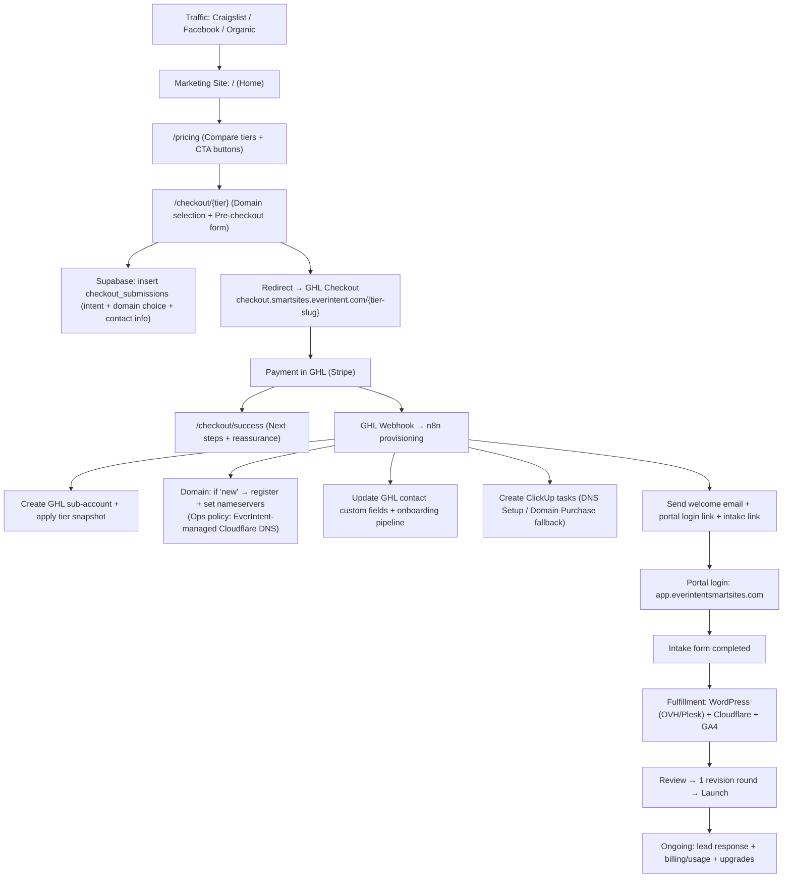

Below is the full persona set (external + internal) that will touch **EverIntentSmartSites.com (marketing site)**, **GHL (master + sub-accounts / SaaS mode)**, **WordPress (Elementor sites)**, **Plesk (hosting control panel)**, and **domain + DNS provisioning (Cloudflare authoritative DNS — never Plesk DNS, per your constraint)**.

I’m listing them in “real life” terms (not just `admin/moderator/user`), and I’m explicit about **which systems each persona touches** so we can validate journeys end-to-end.

---

## External personas (outside EverIntent)

### 1) Anonymous Visitor (Top-of-funnel)

* **Touches:** Marketing site (Vercel/Vite), cookie consent + chat widget, general content pages.
* **Actions:** Browse services/pricing/portfolio; click CTA; maybe use domain search utility page (required in BRD). 

### 2) SmartSites Prospect — “Business Owner / Founder” (Decision maker)

* **Touches:** Marketing site → checkout pre-pages → **GHL checkout** (SaaS mode) → email/SMS follow-ups. 
* **Actions:** Chooses tier (T1–T4), submits “Get Started,” completes checkout.

### 3) SmartSites Prospect — “Needs Help / Book a Call”

* **Touches:** Marketing site (book-call/contact), GHL calendar/booking (once connected), follow-up sequences.
* **Actions:** Books call; responds to sales outreach; may later purchase via GHL checkout. 

### 4) SmartSites Customer — Primary Account Holder (Post-purchase)

* **Touches:** **GHL Portal** (T1 has “neutered” dashboard; T2–T4 use fuller portal) + support email/chat depending on tier.  
* **Actions:** Completes intake; reviews staging link; requests revisions; upgrades/downgrades/cancels. 

### 5) SmartSites Customer Team Member (“Operator” seat)

Examples: office manager, dispatcher, receptionist, marketing assistant.

* **Touches:** **GHL sub-account** features enabled by snapshot (conversations, calendar, pipeline, etc.). 
* **Actions:** Responds to leads, manages inbox, books appointments, moves pipeline stages.

### 6) SmartSites Customer “Domain Admin” (Customer-owned domain case)

* **Touches:** Their registrar / DNS provider UI (GoDaddy, etc.) **or Cloudflare if they delegate it**.
* **Actions:** Updates nameservers / DNS records to point site live; verifies propagation.
* **Why they exist in BRD:** Domain choice supports `namecheap/customer_owned` and domain status workflow. 

### 7) LocalPros Partner Provider — Applicant (External partner applying)

* **Touches:** `/localpros/apply` form (marketing site), follow-up comms in **GHL Master account** partner pipeline. 
* **Actions:** Applies; supplies service area/insurance/license; accepts terms for lead buying.

### 8) LocalPros Partner Provider — Active Lead Buyer

* **Touches:** Primarily **SMS/email notifications + lead comms**, driven by automation in **GHL Master account** (LocalPros Leads pipeline). 
* **Actions:** Receives leads; accepts/declines; closes jobs; may become upsell candidate.

### 9) LocalPros Partner Provider — “Converted to SmartSites”

(They become a SmartSites customer via option A/B/C.)

* **Touches:** **GHL sub-account** once provisioned; may have brand/domain transition steps depending on conversion option. 
* **Actions:** Onboards into SmartSites; may rebrand a transferred/rented site.

### 10) LocalPros Consumer Lead (End customer)

This is the homeowner/patient/caller who fills out a LocalPros portfolio site form or calls.

* **Touches:** **WordPress portfolio site** (public website) + phone/chat.
* **Actions:** Submits inquiry; makes call; gets routed into LocalPros GHL master lead handling. 

### 11) Careers Applicant (Job seeker)

* **Touches:** `/careers` and `/careers/:slug` + application form + optional resume upload. 
* **Actions:** Applies; optionally submits Loom/portfolio if required; expects confirmation + follow-up.

### 12) Data Subject / Privacy Requestor

* **Touches:** legal pages + data request process (DSAR). 
* **Actions:** Requests deletion/export; disputes consent; asks about lead sharing/cookies.

---

## Internal personas (EverIntent team / contractors)

### A) SmartSites Super Admin (Owner / Root Operator)

* **Touches:**

  * SmartSites Admin UI (Supabase-backed)
  * **GHL master account** + SaaS settings
  * Stripe account
  * Cloudflare (DNS/CDN)
  * Plesk + WordPress admin (as needed)
  * n8n automation + secrets
* **Actions:** Configures offers/tiers; reviews escalations; handles billing/support edge cases; approves policy decisions.

### B) SmartSites Admin Ops (Fulfillment coordinator)

* **Touches:** Admin dashboard (submissions/jobs/portfolio/testimonials), GHL pipelines/stages, ClickUp tasks per SOP.  
* **Actions:** Reviews intake; triggers build workflow; communicates status updates; monitors SLA.

### C) Sales / Closer (Revenue operator)

* **Touches:** **GHL master account** (pipelines, conversations, calendars), checkout conversion tracking, follow-ups. 
* **Actions:** Qualifies leads; books calls; closes checkout; drives upgrades (T1 → T2–T4). 

### D) Customer Support Agent (Tiered support)

* **Touches:** Support inbox (Google Workspace), GHL conversations/chat, upgrade/downgrade/cancel handling. 
* **Actions:** Responds to tickets; triggers downgrade schedule; retention offers; ensures churn prevention.

### E) Web Builder / Implementer (Production)

* **Touches:** **Plesk** (site provisioning) + **WordPress admin** + Elementor; GA4 install; validates DNS propagation during launch. 
* **Actions:** Creates WP site; installs theme/plugins; builds pages; config contact form; publishes.

### F) Domain & DNS Operator (Hard requirement: Cloudflare DNS only)

* **Touches:** Domain registrar (Namecheap API/manual) + **Cloudflare DNS** (authoritative zone mgmt) + Plesk only for hosting target. 
* **Actions:** Buys domain (if new); attaches/creates Cloudflare zone; sets DNS records; manages SSL/CDN; verifies propagation.
* **Constraint honored:** Cloudflare is DNS authority; **Plesk DNS disabled/not used** (per your rule).

### G) Automation Engineer (Edge/N8N/Infra)

* **Touches:** Supabase (DB/RLS/Storage/Edge Functions), n8n workflows (checkout webhooks), logging/monitoring. 
* **Actions:** Maintains provisioning automation (sub-account creation, domain purchase, tagging, note sync, retries).

### H) Billing / Finance Operator

* **Touches:** Stripe products/subscriptions; GHL SaaS billing + wallet/overages model. 
* **Actions:** Handles payment failures/refunds; verifies wallet rebilling; reconciles subscription state.

### I) Marketing / Analytics Operator

* **Touches:** GA4 house account workflows; tracking install on WP; dashboard reporting to customers (email PDFs for T1, portal for T2–T4). 
* **Actions:** Creates GA4 properties; ensures measurement IDs; validates events; resolves attribution issues.

### J) Recruiting / HR Operator

* **Touches:** `/admin/careers` job CRUD; applicant pipeline in GHL; resume review links and tags. 
* **Actions:** Posts/updates jobs; filters applicants; coordinates interviews.

### K) Compliance / Deliverability / Phone Ops

* **Touches:** TCPA language, bot disclosure, DNC workflows, A2P considerations, consent auditing (forms + GHL tags/notes).  
* **Actions:** Ensures consent capture; verifies disclosure scripts; enforces compliance requirements.

---

## Quick sanity check: which personas touch which systems?

* **Marketing Site:** Everyone external + internal admin ops/content.
* **GHL Master:** Sales, support, LocalPros lead ops, recruiting, compliance. 
* **GHL Sub-accounts:** SmartSites customers + their staff (operators). 
* **WordPress:** Web builder (internal); LocalPros consumers only as *site visitors*; customers potentially as content editors *if/when you grant access* (not assumed).
* **Plesk:** Web builder + domain/DNS ops (hosting only), never for DNS. 
* **Domain provisioning (registrar) + DNS:** Domain/DNS operator + automation engineer; customer domain admin for “customer-owned domain” cases. 

## Refinded Persona Soecification

## Personas (internal + external) and the systems they touch

### External personas

1. **Buyer (Business Owner / Decision Maker)**

* Touches: **Marketing site** (pricing + checkout flow), **GHL Checkout** (payment), **Email** (welcome + intake links), **GHL Portal** (at least a dashboard), sometimes **Domain registrar** (if bringing existing domain), sometimes **DNS** (if they insist on self-managing).
* Key “handoff” surfaces: `/pricing` → `/checkout/*` → GHL checkout → portal invite/intake.

2. **Customer Operator (Day-to-day user: office manager / receptionist / owner-operator)**

* Touches: **GHL Portal** (conversations, missed-call text-back, pipeline, reporting depending on tier), **Email/SMS** (notifications), **WordPress** (rare; usually EverIntent-managed), sometimes **DNS/Domain registrar** if they own the domain.
* Key “handoff” surfaces: portal login + lead response workflows.

3. **LocalPros Partner (lead buyer / service provider)**

* Touches: **Marketing site** (`/localpros`, `/localpros/apply`), **GHL Master Account** (lead delivery + accept/decline flows via automation), **SMS/Email** notifications (lead alerts). The BRD defines a LocalPros pipeline with stages like *New Lead → Sent to Partner → Accepted/Declined* etc. 

4. **Careers Applicant**

* Touches: **Marketing site** (`/careers`, `/careers/:slug`), **application form** (cover note + optional resume upload), then backend **Edge Function** processing. 

### Internal personas

5. **EverIntent Admin / Ops (admin dashboard user)**

* Touches: **Admin UI** (Supabase-backed), **Supabase** (review submissions), **GHL Master + SaaS admin**, **n8n**, **Namecheap**, **Cloudflare DNS**, **ClickUp**, **Stripe**.

6. **EverIntent Fulfillment (Web Builder / Launch tech)**

* Touches: **Plesk** (hosting + WP install), **WordPress + Elementor**, **Cloudflare** (CDN + DNS), **GA4** setup, **ClickUp** tasks. Build SOP is explicitly Day 0–Day 5. 

7. **EverIntent Support / Success**

* Touches: **GHL conversations**, **email support**, **billing support** (Stripe/GHL SaaS), downgrade/cancel flows. Support model by tier is defined. 

---

# Part 1 — “Click to Buy” (buyer journey for ANY tier) with routes + what they experience

### What the buyer sees (and where it lives)

The BRD’s intended “ready to buy” path is:

* **Marketing site** (Vite/React/SSG): “Get Started” drives to `/pricing` 
* **Checkout pre-flow pages** (still on marketing site): `/checkout/*` routes exist for each tier 
* **Payment** happens on **GHL-hosted checkout**: `https://checkout.smartsites.everintent.com/[tier-slug]` 
* **Portal** is on the white-label domain: `app.everintentsmartsites.com` 

### Route map (marketing site) the buyer actually traverses

* `/` (Home)
* `/pricing` (primary conversion hub from “Get Started”) 
* `/checkout/smart-site` (T1), `/checkout/smart-lead` (T2), `/checkout/smart-business` (T3), `/checkout/smart-growth` (T4) 
* `/checkout/success` (exists in routes; becomes your “What happens next” reinforcement page) 
* `/domains` (standalone domain search utility) 
* If they need help instead of buying: “Book a Call” goes to `/contact` 

---

## Diagram: buyer click-to-buy flow (routes + systems)

Key BRD behaviors embedded in this diagram:

* Checkout steps 1–4 (domain selection → pre-checkout form → GHL payment) 
* Post-payment provisioning is driven by a GHL webhook into n8n to create sub-account, apply snapshot, optionally register domain, send welcome email + intake, and add to onboarding pipeline 
* Domain purchase + “DNS Setup” ClickUp task creation is explicitly called out in the domain automation section 

---

## Step-by-step buyer experience you can explain to business owners

### 0) “Ready to buy” vs “Need help”

* If they’re ready: **Get Started → `/pricing`** 
* If they want guidance: **Book a Call → `/contact`** (30-min consult path) 

### 1) Plan selection (on your marketing site)

* **Route:** `/pricing`
* **What they see:** the 4 tiers and a “start” button for each.
* **What happens next:** clicking a tier takes them into that tier’s **pre-checkout** experience on your site (not a third-party checkout yet). 

### 2) Domain selection (still on your marketing site)

* **Route:** `/checkout/{tier}`
* **What they see:**

  * “Do you have a domain name?” (existing vs new) 
  * If “new”, a search UI backed by Namecheap domain search 
* **Support-risk moment:** domain confusion.

  * You reduce tickets by making the “existing vs new” choice explicit and telling them exactly what will happen after purchase (“we’ll send DNS instructions after purchase” is explicitly in BRD copy) 

### 3) Pre-checkout form (still on your marketing site)

* **Route:** `/checkout/{tier}` (step 3 in-page)
* **What they see:** basic identity + business info + TCPA consent checkbox 
* **Behind the scenes:**

  * **Save to Supabase**
  * **Redirect to GHL Checkout with params** 

### 4) Payment (GHL-hosted checkout)

* **Where:** `checkout.smartsites.everintent.com/{tier-slug}` 
* **What they see:** a normal credit-card checkout with Terms/Privacy checkbox and the plan price (example shows Smart Site $249) 
* **Billing models (BRD):**

  * T1: $249 one-time, plus later $149/year renewal after year 1 
  * T2–T4: monthly subscriptions ($97 / $197 / $497) 
  * T2–T4 also have usage overages via wallet auto-recharge 

### 5) Immediately after payment: “everything is in motion”

* **What the buyer experiences:**

  * A success state (your `/checkout/success` page is where you should reinforce “check inbox + portal link + intake link”). `/checkout/success` is in the BRD route list. 
  * Then an email that explicitly explains: intake in ~5 minutes, fill it out, site built in 5 business days, review + launch. 
* **Behind the scenes (automation):** GHL webhook → n8n provisions their account and kicks off onboarding. 

### 6) Portal experience depends on tier

* **Portal domain:** `app.everintentsmartsites.com` 
* **T1 (“neutered” portal):** simplified dashboard focused on analytics + upgrade CTA; BRD explicitly shows a “Ready to grow?” upgrade panel + quick links. 
* **T2–T4:** full GHL dashboard/features enabled per tier snapshot. 

### 7) Intake → build → review → launch

* **Key state fields in GHL:** domain_status, intake_status, site_status (building/review/live). 
* **Fulfillment timeline:** the BRD SOP is a Day 0–Day 5 execution (intake complete → setup → build → review → launch). 
* **Support model by tier:** T1 is email-only; chat begins at T2; phone is only T4. 

---

# Part 2 — Persona → Journey Responsibility Matrix (owners + system state transitions)

Below are the **exact handoffs** you called out (DNS + intake + portal login + lead response) plus the surrounding steps, with **who owns it**, **what system it touches**, and the **state transition** that should be observable.

## 2A) SmartSites buyer + customer operator journey (T1–T4)

> Legend: “System state transition” is written in **observable** terms (e.g., “GHL custom field `intake_status` goes pending → complete”). Those fields are defined in BRD. 

| Journey step                                 | External owner                                | Internal owner                           | Systems touched                                                                             | System state transitions triggered                                                                                                  | Support-risk handoff + hardening                                                                                                                                                                |
| -------------------------------------------- | --------------------------------------------- | ---------------------------------------- | ------------------------------------------------------------------------------------------- | ----------------------------------------------------------------------------------------------------------------------------------- | ----------------------------------------------------------------------------------------------------------------------------------------------------------------------------------------------- |
| 1) Entry → pricing                           | Buyer                                         | —                                        | Marketing site `/` → `/pricing` (Get Started goes to pricing)                               | none                                                                                                                                | Low risk. Keep plan CTAs simple + consistent.                                                                                                                                                   |
| 2) Choose tier                               | Buyer                                         | —                                        | `/pricing` → `/checkout/{tier}`                                                             | none                                                                                                                                | Low risk. Reinforce “includes domain + DNS + SSL” copy (align with `/domains` promise).                                                                                                         |
| 3) Domain choice (existing vs new)           | Buyer                                         | —                                        | `/checkout/{tier}` domain step                                                              | **GHL field later:** `domain_choice` = new/existing                                                                                 | **HIGH (DNS)**: This is where confusion starts. Hardening: show 2 explicit cards + “what happens next” microcopy (“We’ll send DNS instructions after purchase”).                                |
| 4) Pre-checkout identity + consent           | Buyer                                         | —                                        | `/checkout/{tier}` pre-form                                                                 | **Supabase:** new checkout submission row created; intent captured.                                                                 | Medium. Hardening: clear error messages, confirm email/phone formatting before redirect.                                                                                                        |
| 5) Redirect to payment                       | Buyer                                         | —                                        | Redirect → GHL checkout  + checkout URL pattern                                             | none                                                                                                                                | Medium. Hardening: loading state + “you’ll be taken to secure checkout” message.                                                                                                                |
| 6) Complete purchase                         | Buyer                                         | —                                        | GHL SaaS checkout (Stripe)                                                                  | **Payment success** triggers webhook.                                                                                               | Medium. Hardening: ensure “Terms & Privacy” is linked and accessible.                                                                                                                           |
| 7) Provisioning (automation)                 | —                                             | EverIntent Ops (automation owner)        | GHL webhook → n8n actions                                                                   | **GHL:** sub-account created + snapshot applied.                                                                                    | Medium. Hardening: make `/checkout/success` say “Portal + intake email arrive within 5 minutes” (matches welcome email).                                                                        |
| 8) Domain provisioning (if “new”)            | —                                             | EverIntent Ops + Fulfillment             | Namecheap + DNS + ClickUp task creation (BRD shows ClickUp “DNS Setup” after registration)  | **Supabase + GHL:** `domain_status` becomes “registered” for new domains (BRD shows both Supabase patch + GHL custom field update)  | **HIGH (DNS)**: Hardening: show “Domain registered” status in admin + internal task auto-created. If Namecheap API not enabled, use manual purchase queue (“Purchase domain: …” ClickUp task).  |
| 9) Portal login                              | Buyer / Customer Operator                     | EverIntent Ops (deliverability + invite) | Portal link in welcome email; portal host is white-label domain                             | **User account created/invited** in GHL sub-account (implied by portal link + onboarding)                                           | **HIGH (Portal login)**: Hardening: `/checkout/success` + welcome email both include portal link + “use forgot password if needed” + “resend invite” path.                                      |
| 10) Intake completion                        | Buyer or Customer Operator                    | —                                        | Intake form (GHL-triggered) in welcome email within 5 minutes                               | **GHL field:** `intake_status` pending → complete                                                                                   | **HIGH (Intake)**: Hardening: reminders at 2h/24h; intake progress indicator in portal; “10 minutes” promise in email is explicit.                                                              |
| 11) Hosting + WP site created                | —                                             | Fulfillment                              | Plesk + WordPress + Elementor (fulfillment architecture)                                    | **GHL field:** `site_status` building                                                                                               | Medium. Hardening: internal checklist (SOP) and consistent build template.                                                                                                                      |
| 12) DNS cutover (existing domain OR go-live) | Customer Operator (if they control registrar) | Fulfillment                              | Registrar + Cloudflare DNS + SSL + propagation checks                                       | **GHL field:** `domain_status` dns_pending → active                                                                                 | **HIGH (DNS)**: Hardening: provide registrar-specific instructions, short “copy/paste” nameserver values, auto-detect propagation, and keep a single “DNS status” badge in portal/admin.        |
| 13) Review + revision                        | Buyer                                         | Fulfillment                              | Email + staging URL + WP                                                                    | **GHL field:** `site_status` building → review → live                                                                               | Medium. Hardening: explicit “1 revision round” expectation (SOP: Day 5 revisions + launch).                                                                                                     |
| 14) Launch + handoff                         | Buyer/Operator                                | Fulfillment + Ops                        | WP + Cloudflare + GA4                                                                       | **GHL field:** `delivery_date` set; T1 renewal date set later                                                                       | Medium. Hardening: launch email includes “what to do next” + support channel by tier.                                                                                                           |
| 15) Lead response (ongoing, mainly T2+)      | Customer Operator                             | Support/Success                          | GHL conversations + pipeline; T2–T4 have full dashboard/features                            | Pipeline stages advance as leads are handled; automation triggers (MCTB, SMS, etc.)                                                 | **HIGH (Lead response)**: Hardening: first-login checklist + “test lead” + notifications verified during onboarding; keep “lead response SLA” visible in portal.                                |
| 16) Upgrade/downgrade/cancel                 | Buyer                                         | Support/Success                          | Portal CTA → checkout for upgrade; support handles downgrades/cancels                       | Upgrade: cancel T1 renewal subscription + apply new snapshot                                                                        | Medium. Hardening: make upgrade self-serve, keep downgrade/cancel guided to reduce churn.                                                                                                       |

---

## 2B) LocalPros Partner journey (lead buyer) — responsibility + state transitions

| Journey step                   | External owner    | Internal owner | Systems touched                                                  | System state transitions triggered                                                               | Highest support-risk + hardening                                                                                               |
| ------------------------------ | ----------------- | -------------- | ---------------------------------------------------------------- | ------------------------------------------------------------------------------------------------ | ------------------------------------------------------------------------------------------------------------------------------ |
| 1) Learn about Partner Program | LocalPros Partner | —              | Marketing site `/localpros`                                      | none                                                                                             | Low. Clear value prop + “how leads are sent” preview.                                                                          |
| 2) Apply                       | LocalPros Partner | Ops            | `/localpros/apply`  → submission stored + pushed into GHL master | New “partner prospect” record created in GHL master account pipeline (Partners pipeline exists)  | Medium. Hardening: application confirmation + “next steps” email.                                                              |
| 3) Screening/activation        | —                 | Ops            | GHL master account + automations                                 | Partner pipeline: Prospect → Active (buying leads)                                               | Medium. Hardening: one-page onboarding instructions.                                                                           |
| 4) Lead delivery & response    | LocalPros Partner | Ops            | GHL master lead pipeline + SMS/email alerts (defined in BRD)     | Lead pipeline stages move: New Lead → Sent to Partner → Accepted/Declined                        | **HIGH (Lead response)**: Hardening: “accept/decline” instructions in every alert + fallback routing to backup if no response. |

---

## 2C) Careers Applicant journey — responsibility + state transitions

| Journey step                              | External owner | Internal owner | Systems touched                                                                | System state transitions triggered            | Support-risk + hardening                                                                              |
| ----------------------------------------- | -------------- | -------------- | ------------------------------------------------------------------------------ | --------------------------------------------- | ----------------------------------------------------------------------------------------------------- |
| 1) Browse jobs                            | Applicant      | —              | `/careers` list page                                                           | none                                          | Low.                                                                                                  |
| 2) View a job                             | Applicant      | —              | `/careers/:slug` job detail                                                    | none                                          | Low.                                                                                                  |
| 3) Submit application (+ optional resume) | Applicant      | Ops/HR         | Application form requires Name/Email/Phone/Cover Note; optional resume upload  | Submission created + edge function processes  | Medium. Hardening: strict validation + clear error toasts (spec calls for specific error messaging).  |
| 4) Review candidates                      | —              | Ops/HR         | Admin UI + GHL tagging/notes                                                   | Candidate record updated, notes/tags applied  | Low/medium. Hardening: admin retry/resend patterns (avoid digging logs).                              |

---

## The 4 highest support-risk handoffs (your focus areas)

1. **DNS (existing domain → live site)**

* Risk driver: registrar complexity + propagation uncertainty.
* Hardening: single “DNS status” badge tied to `domain_status` (pending/registered/dns_pending/active)  + ClickUp “DNS Setup” task created when domain is registered  + portal/admin copy that sets expectations.

2. **Intake completion**

* Risk driver: buyer doesn’t complete intake; fulfillment stalls.
* Hardening: welcome email already sets expectation (intake in 5 min; 10 minutes to fill) ; reinforce that on `/checkout/success` and add reminder automation until `intake_status=complete` .

3. **Portal login**

* Risk driver: invite email deliverability + password setup confusion.
* Hardening: “portal link + intake link” shown in BOTH success page and welcome email (email template already includes portal_login_link + intake_form_link)  + “Forgot password” guidance + resend-invite CTA.

4. **Lead response (T2+ customers and LocalPros partners)**

* Risk driver: missed alerts, no workflow habits, unclear “what do I click”.
* Hardening: first-login checklist, verified notification settings, test lead, and “response expectations” visible in portal; LocalPros already has explicit pipeline stages that can be used for compliance/QA (Sent → Accepted/Declined). 
